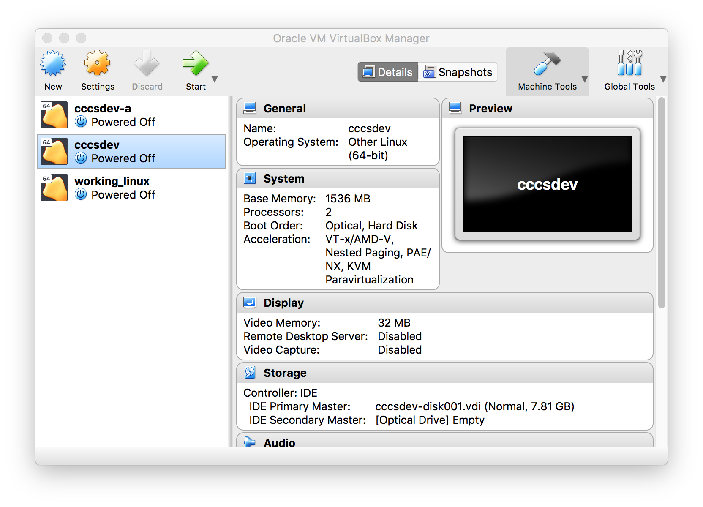
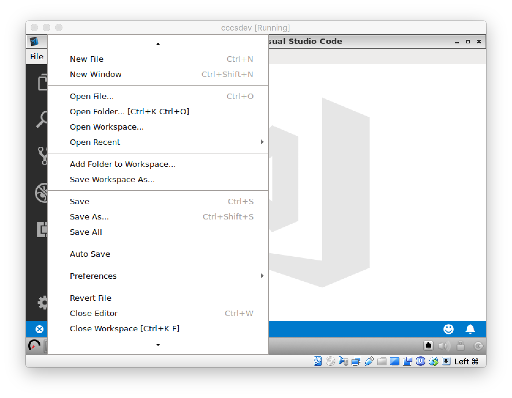
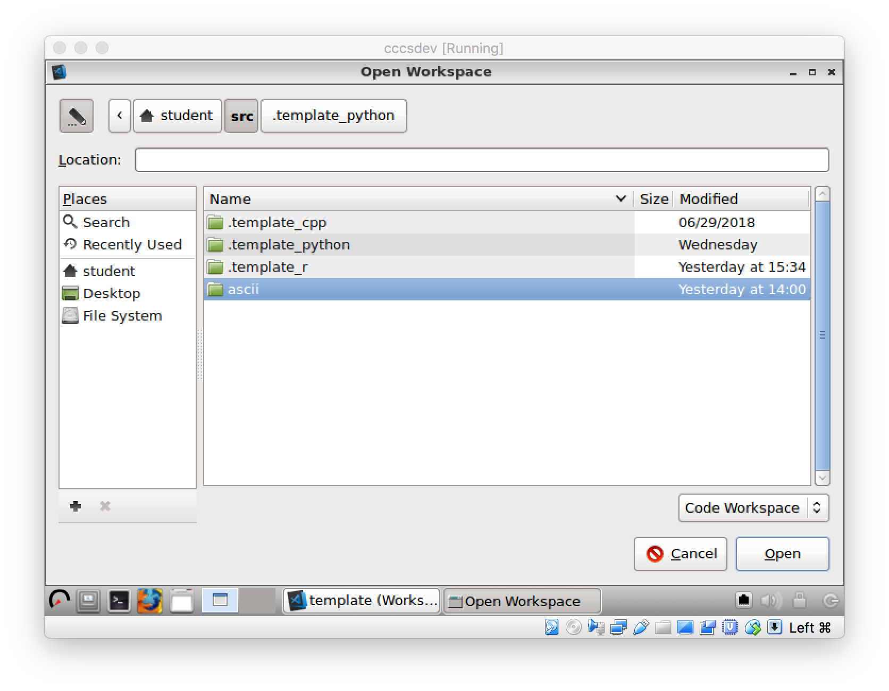
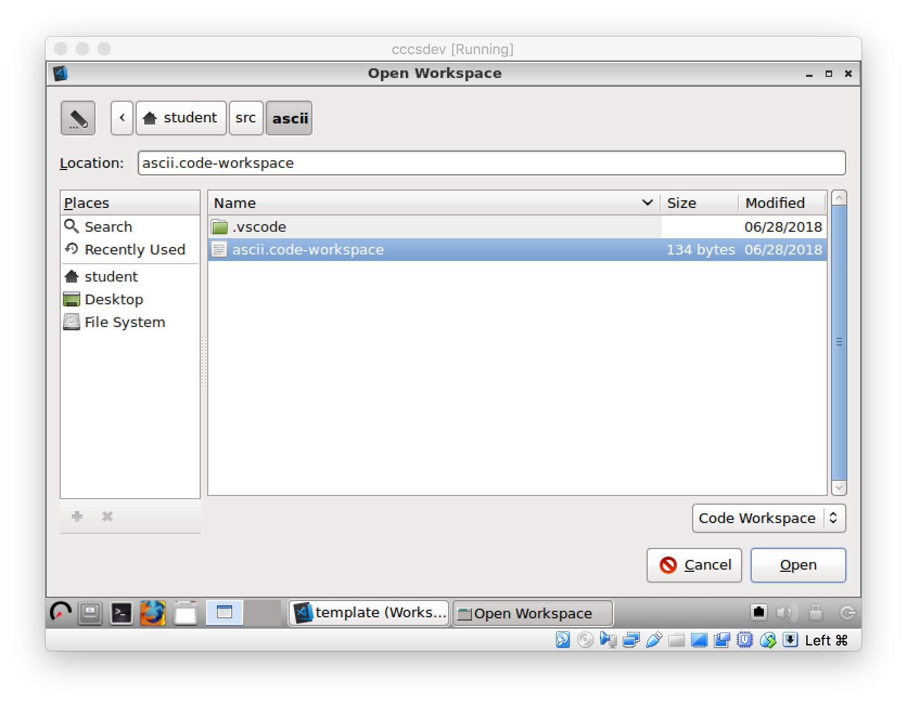
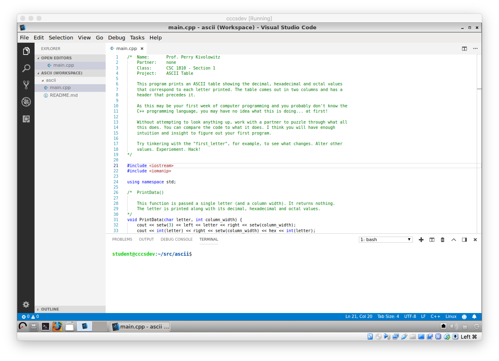

# Our development environment

The text below refers to using C++.

For a video covering the installation see [here](https://vimeo.com/280080837).

For a video covering using CCCSDev for C++, see [video not made yet]().

For a video covering using CCCSDev for Python, see [video not made yet]().

For a video covering using CCCSDev for R, see [video not make yet]().

After installing our development environment, start the VirtualBox (VB) Manager. Note your windows will differ slightly from the following:



You will have only one Virtual Machine (VM) named ```cccsdev``` for Carthage College Computer Science Development. Notice it says it is powered off. Double click on it - a old timey looking screen will come up, just hit the return key. Wait a bit and you'll see this:


Double click on ```Visual Studio Code```. All your programming work will be done in this program.

Use the File --> Open Workspace menu command shown here:



Navigate to ```ascii```. ASCII stands for American Standard Code for Information Interchange. Computers don't know about letters natively - only we do. ASCII is a code for mapping numbers to letters.



Don't go into any of the ```.template``` folders. There's nothing that interesting there. Really.

Double click on the workspace file. Each of your projects (that you'll create in the future) will have a workspace file with a name you pick prepended.



There's a good chance your next screen will be a welcome screen from VSCode. If it is, just close it by clicking on the ```x``` on the tab, not at the upper right of VSCode (that one will close the program). The icon in the dark area at left that looks like multiple pages can be clicked upon to view the files that make up your workspace. If ```main.cpp``` isn't already visible, double click on its name.


